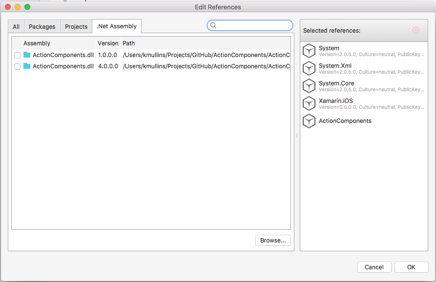

# About Action Download Manager

**Action Download Manager** handles the downloading of one or more files from the internet using either HTTP or FTP protocols. All downloads take place in a background thread so your mobile app's interface remains responsive.

# Running the Samples

Before you can successfully build and run these sample apps, you'll need to download and install the [Action Components Trail](http://appracatappra.com/products/action-components/) version from the Appracatappra website or have purchased and installed a licensed version of the components.

Next, open either the iOS or the Android version of the sample in Visual Studio and expand the **Resources** folder:


If the `ActionComponents` entry is grayed-out with a red X (as shown in the image above), right-click on it and select **Delete**. Double-Click the **Resources** folder to open the **Edit References** dialog and select the **.Net Assembly** tab:



Click the **Browse** button, navigate to where you installed the **Action Components** trial or licensed version and locate the appropriate `ActionComponents.ddl` (for either iOS or Android) and click the **OK** button. The sample will now be ready to run.

# Available Events

**Action Download Manager** provides several events for both the overall batch and for individual files that can be responded to such as:

* **DownloadError**
* **DownloadCanceled**
* **DownloadFileStarted**
* **DownloadFileCompleted**
* **FileDownloadProgressPercent**
* **OverallDownloadProgressPercent**
* **AllDownloadsCompleted**

# iOS Example

Here is an example of downloading a single file in iOS and showing an alert when it is completed:

```csharp
using ActionComponents;
...

private ACDownloadManager _downloadManager;
...

public override void ViewDidLoad ()
{
    //Initialize the manager
    _dowloadManager=new ACDownloadManager();

    //Wireup completion handler
    _downloadManager.AllDownloadsCompleted+= delegate() {
        InvokeOnMainThread(delegate{
            //Display Alert Dialog Box
            using(var alert = new UIAlertView("DownloadManager", "All files have been downloaded", null, "OK", null))
            {
                alert.Show();   
            }
        });
    };

    //Specify the directory to download the file to
    string directory=Environment.GetFolderPath(Environment.SpecialFolder.Personal);

    //Queue up a file to download: Source URL, Directory to download to and optionally renaming the file
    _downloadManager.QueueFile("http://appracatappra.com/wp-content/plugins/download-monitor/download.php?id=4",directory,"NDA.pdf");

    //Start the download process
    _downloadManager.StartDownloading();
}
```

# Android Example

Here is an example of downloading two files in the Android OS:

```csharp
using ActionComponents;
...

[Activity (Label = "DownloadManager", MainLauncher = true)]
public class Activity1 : Activity
{
    #region Constants
    public const int DialogLongMessage = 1;
    #endregion 

    #region Private Variables
    private ACDownloadManager downloadManager;
    private string dialogMessage = "";
    #endregion  

    #region Overrides
    protected override void OnCreate (Bundle bundle)
    {
        base.OnCreate (bundle);

        // Set our view from the "main" layout resource
        SetContentView (Resource.Layout.Main);

        // Create a new download manager
        downloadManager=new ACDownloadManager(); 

        // Get all of our interface items
        ProgressBar bar = FindViewById (Resource.Id.progressBar);
        TextView title = FindViewById (Resource.Id.progressText);
        Button startDownload = FindViewById (Resource.Id.startDownload);
        Button cancel = FindViewById (Resource.Id.cancel);

        // Create path to hold downloaded files
        string directory = System.Environment.GetFolderPath (System.Environment.SpecialFolder.Personal);
        Console.WriteLine("Directory: {0}",directory);

        // Wireup progress bar
        downloadManager.FileDownloadProgressPercent += (percentage) => {

            // Adjust percentage and display
            RunOnUiThread (() => {
                percentage *= 100f;
                bar.Progress = (int)percentage;
            });
        };

        // Wireup completion handler
        downloadManager.AllDownloadsCompleted += () => {

            // Run on UI Thread
            RunOnUiThread (() => {
                // Inform caller
                dialogMessage="All files have been downloaded";
                ShowDialog (DialogLongMessage);

                // Update GUI
                startDownload.Enabled = true;
                title.Visibility = ViewStates.Invisible;
                bar.Visibility = ViewStates.Invisible;
                cancel.Visibility = ViewStates.Invisible;
            });

        };

        // Wireup error handler
        downloadManager.DownloadError += (message) => {

            // Run on UI Thread
            RunOnUiThread (() => {
                // Update GUI
                startDownload.Enabled = true;
                title.Visibility = ViewStates.Invisible;
                bar.Visibility = ViewStates.Invisible;
                cancel.Visibility = ViewStates.Invisible;

                // Inform caller
                dialogMessage=message;
                ShowDialog (DialogLongMessage);
            });
        };

        // Wireup start button
        startDownload.Click += (sender, e) => {

            // Update GUI
            startDownload.Enabled = false;
            title.Visibility = ViewStates.Visible;
            bar.Visibility = ViewStates.Visible;
            cancel.Visibility = ViewStates.Visible;

            // Queue up files to download
            downloadManager.QueueFile ("http://appracatappra.com/wp-content/uploads/et_temp/ssh-140751_232x117.jpg",directory);
            downloadManager.QueueFile ("http://appracatappra.com/wp-content/uploads/et_temp/4-TD-web-5-662620_960x332.png",directory);

            // Start the download process
            ThreadPool.QueueUserWorkItem((callback) =>{
                downloadManager.StartDownloading();
            });

        };

        // Wireup cancel button
        cancel.Click += (sender, e) => {

            // Stop any running downloads
            downloadManager.AbortDownload ();

            // Update GUI
            startDowload.Enabled = true;
            title.Visibility = ViewStates.Invisible;
            bar.Visibility = ViewStates.Invisible;
            cancel.Visibility = ViewStates.Invisible;

            // Inform user
            dialogMessage="User has aborted all downloads";
            ShowDialog (DialogLongMessage);
        };

    }

    protected override Dialog OnCreateDialog (int id)
    {
        Dialog alert = null;

        base.OnCreateDialog (id);

        // Build requested dialog type
        switch (id){
        case DialogLongMessage:
            var builder = new AlertDialog.Builder(this);
            builder.SetIcon (Android.Resource.Attribute.AlertDialogIcon);
            builder.SetTitle ("DownloadManager");
            builder.SetMessage(dialogMessage);
            builder.SetPositiveButton ("OK", delegate(object sender, DialogClickEventArgs e) {
                // Ignore for now
            });
            alert=builder.Create ();
            break;
        }

        // Return dialog
        return alert;
    }
    #endregion 
}
```

# Trial Version

The trial version of **Action Download Manager** is limited to downloading a batch of no more than five (5) files at a time and then only image files in the `.jpg` format. The full version removes these restrictions.